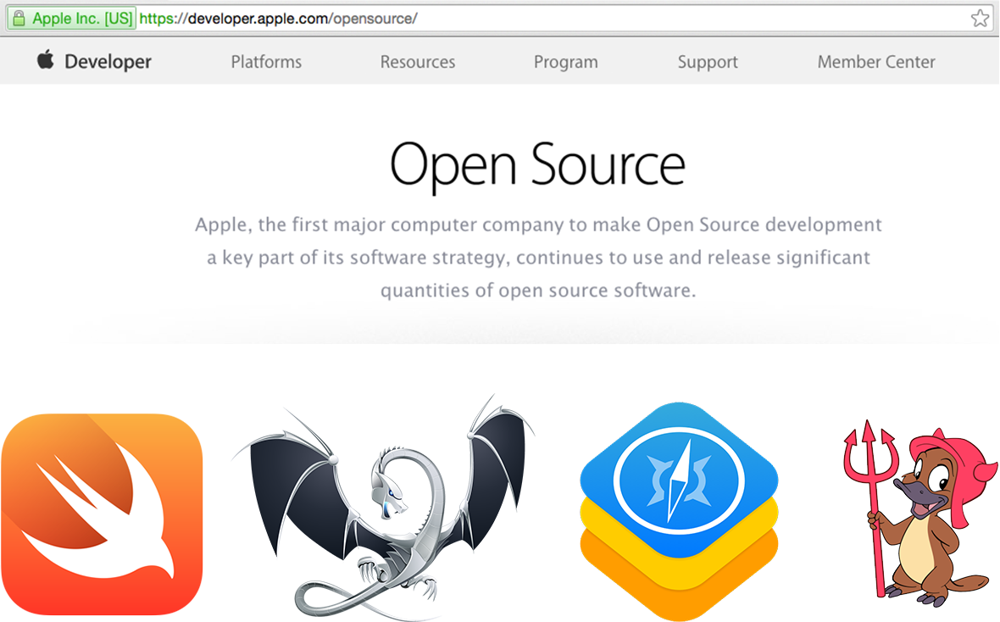
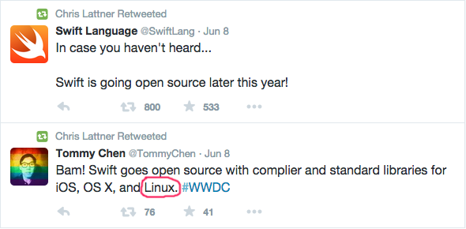
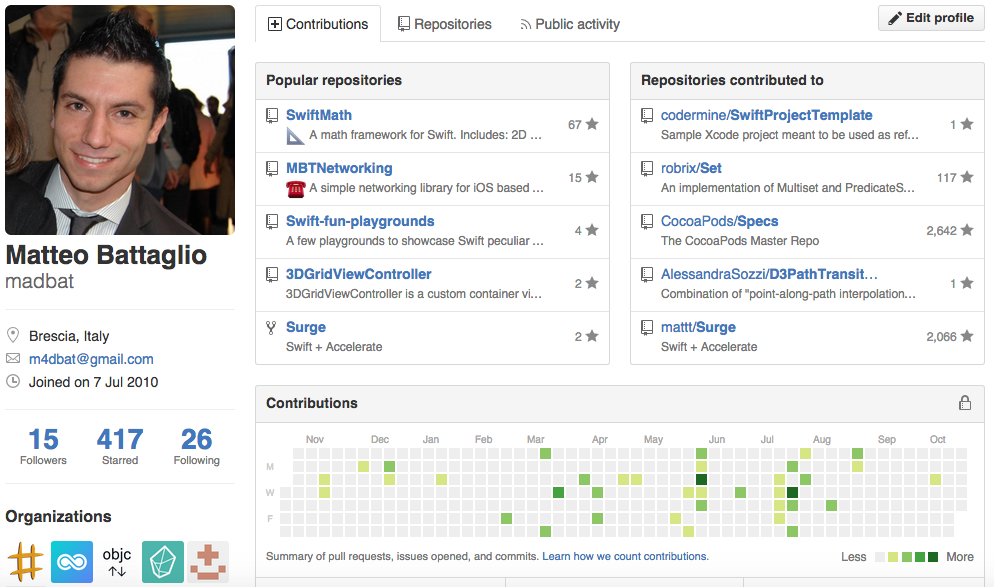

## **Strumenti liberi**

## per

## **teste chiuse!**

---

## a.k.a.
# **The Apple** Open Source **Scene**

---

# **Who am I**

Matteo Battaglio
[@m4dbat](https://twitter.com/@m4dbat)

- **co-founder, [#pragma mark](https://twitter.com/@pragmamarkorg) ios dev community**

- ### **Software Engineer**
[@Codermine](https://twitter.com/@codermine)
*(but soon* [@bending_spoons](https://twitter.com/@bending_spoons)*)*

---

#### **Fig. 1 — Apple, as pictured by Linux advocates**

---

#### **Fig. 2 — Me, right now, to your eyes**

---

## **Reality**

---

# **Mac OS X**

- *POSIX Certified:* all of your loved unix/gnu programs preinstalled (bash, vim, emacs, grep, gcc...)

- *DARWIN:* open source core of OS X and ios. built around XNU: a hybrid kernel (Mach 3 + BSD)

- *RUBY & PYHTON* preinstalled

---

# **Chris Lattner**

#### Apple's Senior Director and Architect, Developer Tools Department
### creator of **LLVM**, **Clang** and **Swift**

---

#   **LLVM**

[www.llvm.org](http://www.llvm.org)

---

# **Swift**

---

# **Swift Features**

- Super fast (compiled)
- Great type system and type inference engine
- Complely interoperable with (Objective-)C
- Playground and REPL (feels like a scripting language)

---

# **Other Apple contributions**

- C *[blocks](http://compiler-rt.llvm.org/)* and *[Grand Central Dispatch](https://libdispatch.macosforge.org/)*

- *[WebKit](https://www.webkit.org)*: web browser engine used by safari, chrome and others

- *[ResearchKit](https://github.com/ResearchKit/ResearchKit)*: framework to make medical research easier

---

# **Great OSS projects for developers**

*By the community*

- *[Homebrew](http://brew.sh):* package manager for OS X
- *[CocoaPods](https://cocoapods.org):* dependency manager for Cocoa projects
- *[FastLane](https://fastlane.tools):* collection of automated app deployment tools

*By Github*

- *[Atom](https://atom.io):* "a hackable text editor for the 21st century"

---

# **Make your own!**

It's fun and rewarding

---

# **Thank You**

